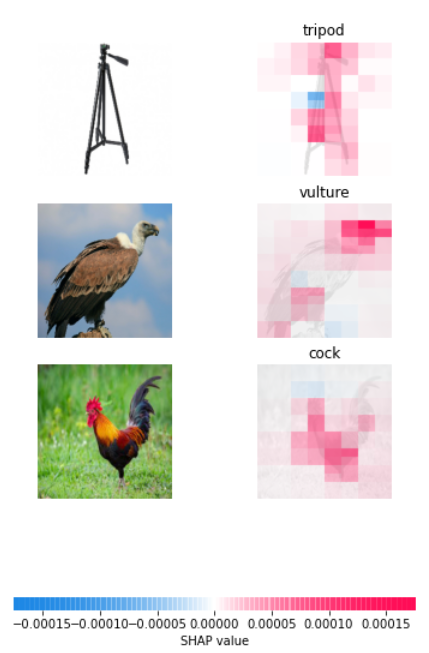

here we use Shap library for explaining a Blackbox of deep learning model and machine learning.
we use the ResNet50 model from transfer learning and use custom datasets.
finally, you can see a  red and blue pixel in the photo.  
Red pixels increase the model's output while blue pixels decrease the output.
Results:

 
